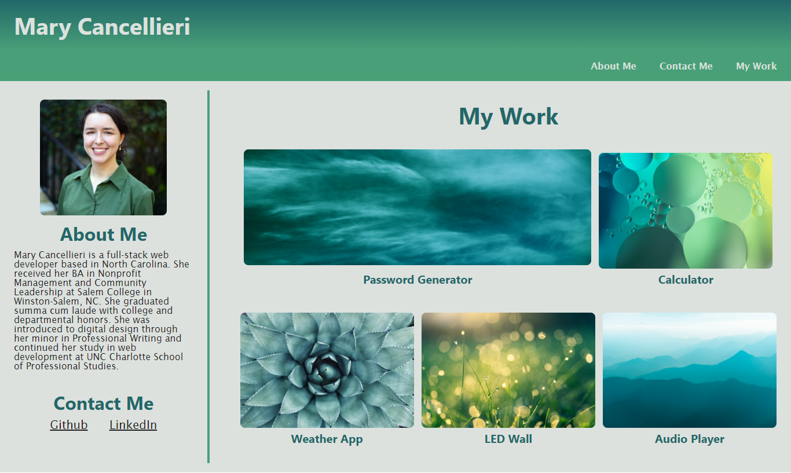

# My First Portfolio Design

[Live Site](https://mycancel.github.io/portfolio/)

## Description

This portfolio is designed to feature my previous work. When each project is clicked, the user is taken to the associated GitHub repository. The page includes a section about me, a catalog of work, and information about where to contact me. The page was also designed to be responsive to the size of the browser.

## Visuals

